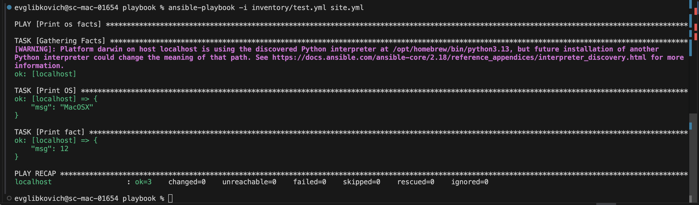
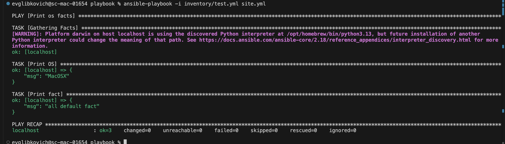
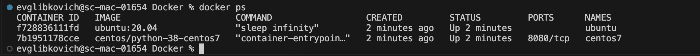
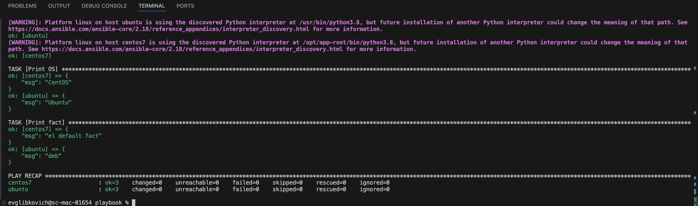
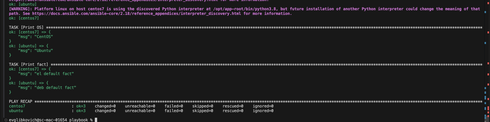
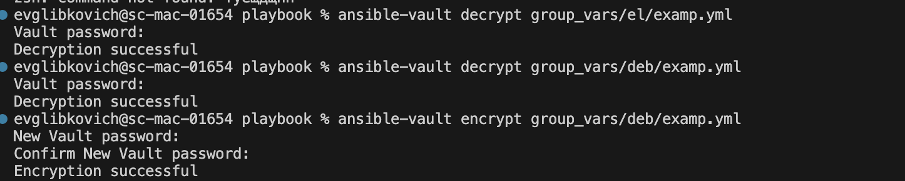
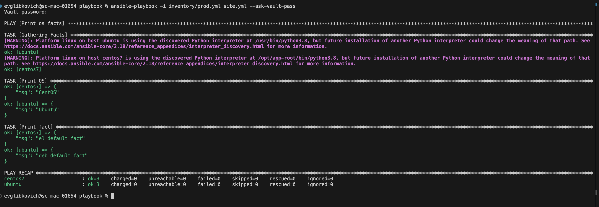
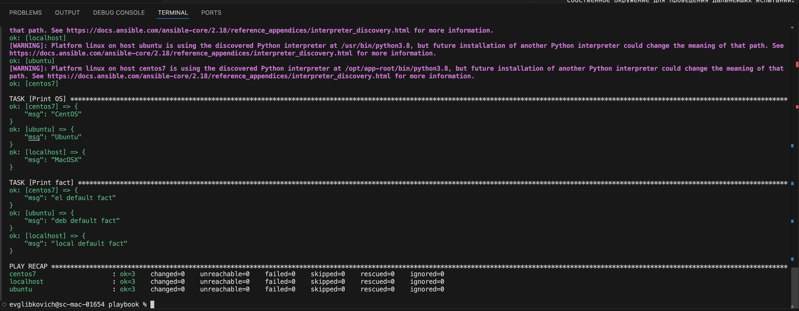

Пункт 1

Зафиксируйте значение, которое имеет факт `some_fact` для указанного хоста при выполнении playbook.

Пункт 2 
Найдите файл с переменными (group_vars), в котором задаётся найденное в первом пункте значение, и поменяйте его на `all default fact`.

Пункт 3

Пункт 4

Пункт 6

Пункт 7 

Пункт 8 

Пункт 10/11

